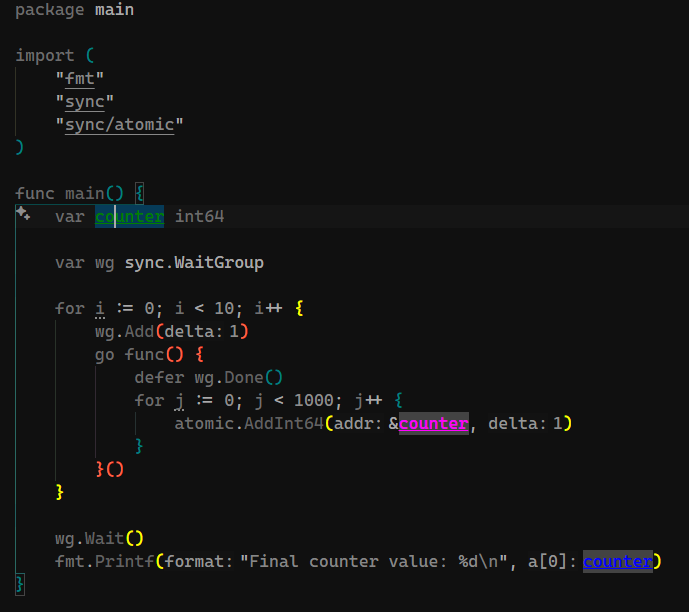

# Go Analyzer - LSP Server

[](https://crates.io/crates/go-analyzer)

A high-performance **Language Server Protocol (LSP)** implementation for Go code analysis, written in Rust. Provides real-time variable lifecycle tracking, data race detection, and advanced static analysis capabilities.



## Features

🚀 **High Performance**

- Built in Rust for maximum speed and memory safety
- Asynchronous processing with Tokio runtime
- Incremental parsing with tree-sitter
- Smart caching with automatic cleanup

🔍 **Advanced Analysis**

- **Variable Lifecycle Tracking**: Complete variable scope and usage analysis
- **Data Race Detection**: Intelligent goroutine and concurrency analysis
- **Context-Aware Analysis**: Support for all Go constructs (structs, interfaces, methods)
- **Severity Classification**: High/Medium/Low priority race condition detection

## Installation

Install the LSP server using Cargo:

```bash
cargo install go-analyzer
```

This will install the `go-analyzer` binary to your `~/.cargo/bin` directory.

## Usage

The `go-analyzer` binary implements the Language Server Protocol and can be used with any LSP-compatible editor.

The server communicates via stdin/stdout using the LSP protocol.

### Editor Integration

#### VS Code

Install the [Go Analyzer extension](https://marketplace.visualstudio.com/items?itemName=vremyavnikuda.go-analyzer) from the marketplace.

#### Neovim

#### Emacs (lsp-mode)

#### Vim (vim-lsp)

---

## LSP Capabilities

The server implements the following LSP features:

- **Hover**: Detailed variable information with lifecycle data
- **Execute Command**: Custom analysis commands
  - `goanalyzer/cursor`: Analyze variable at cursor position
- **Text Document Sync**: Full document synchronization
- **Custom Notifications**: Progress updates and indexing status

## Configuration

The server accepts the following environment variables:

- `GO_ANALYZER_LOG_LEVEL`: Set logging level (`debug`, `info`, `warn`, `error`)
- `GO_ANALYZER_CACHE_SIZE`: Maximum number of cached AST trees (default: 20)
- `GO_ANALYZER_CACHE_TTL`: Cache time-to-live in seconds (default: 300)

## Architecture

### Core Components

- **LSP Server**: Tower-LSP based server implementation
- **Go Parser**: Tree-sitter Go grammar for accurate parsing
- **Analysis Engine**: Variable tracking and race detection algorithms
- **Cache System**: Intelligent AST caching with TTL and size limits

### Analysis Pipeline

1. **File Parsing**: Go source code → AST via tree-sitter
2. **Variable Extraction**: Identify declarations, usages, and scopes
3. **Race Detection**: Analyze goroutine patterns and synchronization
4. **Result Generation**: Create LSP-compatible analysis results

## Performance

- **Startup Time**: < 100ms typical startup
- **Analysis Speed**: < 50ms for files up to 2000 lines
- **Memory Usage**: < 50MB with caching enabled
- **CPU Usage**: < 5% during active analysis, 0% when idle

## Development

### Building from Source

```bash
git clone https://github.com/vremyavnikuda/go-analyzer-rs.git
cd go-analyzer-rs
cargo build --release
```

### Running Tests

```bash
cargo test
```

### Contributing

Contributions are welcome! Please see our [GitHub repository](https://github.com/vremyavnikuda/go-analyzer-rs) for development guidelines.

## License

Licensed under the MIT License. See [LICENSE](LICENSE) for details.

## Related Projects

- [VS Code Extension](https://marketplace.visualstudio.com/items?itemName=vremyavnikuda.go-analyzer) - VS Code integration
- [tree-sitter-go](https://github.com/tree-sitter/tree-sitter-go) - Go grammar for tree-sitter

---

For more information, visit the [project repository](https://github.com/vremyavnikuda/go-analyzer-rs).
