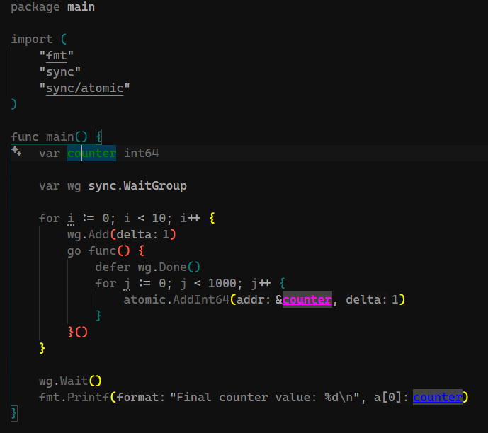

# Go Analyzer - Инструмент статического анализа кода Go

[](https://marketplace.visualstudio.com/items?itemName=vremyavnikuda.go-analyzer)
[](https://crates.io/crates/go-analyzer)
[](https://opensource.org/licenses/MIT)

## 📋 Описание проекта

**Go Analyzer** — это высокопроизводительный инструмент статического анализа кода Go, который обеспечивает анализ жизненного цикла переменных в реальном времени, обнаружение состояний гонки данных и визуальный анализ потока кода. Проект состоит из LSP-сервера, написанного на Rust, и расширения для VS Code на TypeScript, обеспечивающих бесшовную интеграцию с средой разработки.

Инструмент помогает разработчикам Go писать более безопасный и надёжный код за счёт автоматического обнаружения потенциальных проблем с безопасностью в многопоточном коде, отслеживания использования переменных и предоставления визуальной обратной связи прямо в редакторе кода.

## 🛠️ Технологический стек

### **Серверная часть (LSP Server)**

- **Rust** - Основной язык программирования для высокой производительности
- **Tower-LSP** - Фреймворк для реализации Language Server Protocol
- **Tree-sitter** - Парсер синтаксиса Go для точного анализа кода
- **Tokio** - Асинхронная среда выполнения для обработки запросов
- **Serde** - Сериализация/десериализация данных LSP

### **Клиентская часть (VS Code Extension)**

- **TypeScript** - Язык разработки расширения VS Code
- **VS Code Extension API** - Интеграция с редактором
- **Node.js** - Среда выполнения для расширения
- **LSP Client** - Коммуникация с LSP-сервером

### **Сборка и развёртывание**

- **Cargo** - Система сборки и управления зависимостями Rust
- **npm/vsce** - Упаковка и публикация расширения VS Code
- **Cross-platform** - Поддержка Windows, macOS, Linux

## 🎯 Цели проекта

### **Основные цели:**

1. **Повышение безопасности кода Go**

   - Автоматическое обнаружение состояний гонки данных (data races)
   - Анализ безопасности многопоточного кода
   - Предупреждения о потенциальных проблемах синхронизации

2. **Улучшение качества разработки**

   - Отслеживание жизненного цикла переменных
   - Визуализация использования переменных в коде
   - Контекстно-зависимый анализ структур, интерфейсов и методов

3. **Максимальная производительность**

   - Использование Rust для критически важной производительности
   - Интеллектуальное кэширование AST-деревьев
   - Адаптивная задержка анализа в зависимости от размера файла

4. **Удобство использования**
   - Бесшовная интеграция с VS Code
   - Настраиваемые цветовые схемы и конфигурации
   - Интуитивный пользовательский интерфейс

### **Дополнительные цели:**

- **Расширяемость**: Модульная архитектура для добавления новых видов анализа
- **Кроссплатформенность**: Поддержка всех основных операционных систем
- **Производительность**: Анализ файлов до 2000 строк менее чем за 50ms
- **Память**: Потребление менее 50MB с включённым кэшированием

## 📦 Установка

Для корректной работы Go Analyzer необходимо установить два компонента:

### 1. 📥 Расширение VS Code

Установите расширение из VS Code Marketplace:

**🔗 [Go Analyzer Extension](https://marketplace.visualstudio.com/items?itemName=vremyavnikuda.go-analyzer)**

**Что это такое?** Подробную информацию о возможностях расширения читайте в файле [`vscode\README.md`](vscode/README.md)

### 2. ⚙️ LSP Сервер

Установите LSP-сервер через Cargo:

```bash
cargo install go-analyzer
```

**🔗 [Go Analyzer LSP Server](https://crates.io/crates/go-analyzer)**

**Что это такое?** Подробную информацию о LSP-сервере читайте в файле [`README_CRATES.md`](README_CRATES.md)

### 3. 🔧 Устранение неполадок

**Если расширение не может найти сервер**, следуйте инструкциям по настройке PATH:

**📖 [Руководство по настройке PATH](doc/PATH_SETUP.md)**

Это руководство содержит подробные инструкции для:

- Windows (PowerShell, Command Prompt, GUI)
- Linux (Bash, Zsh, Fish)
- macOS (Bash/Zsh)

## ✨ Основные возможности

### 🔍 **Анализ жизненного цикла переменных**

- Отслеживание области видимости и использования переменных в реальном времени
- Визуальная подсветка объявлений, использований и операций с указателями
- Контекстно-зависимый анализ для структур, интерфейсов и методов

### 🚨 **Обнаружение состояний гонки данных**

- Интеллектуальный анализ горутин с классификацией серьёзности
- Предупреждения о безопасности многопоточности при доступе к общим переменным
- Обнаружение синхронизации (мьютексы, каналы, атомарные операции)

### 🎨 **Визуальные улучшения кода**

- Цветовая кодировка декораций для различных состояний переменных
- Информация при наведении курсора с подробными данными жизненного цикла
- Визуализация графа кода, показывающего связи между компонентами

### ⚡ **Оптимизированная производительность**

- LSP-сервер на Rust для максимальной скорости
- Адаптивная задержка на основе размера файла
- Эффективное кэширование с автоматической очисткой

## 🚀 Быстрый старт

1. **Установите** расширение из VS Code Marketplace
2. **Установите LSP-сервер**: `cargo install go-analyzer`
3. **Откройте** любой Go файл в вашем рабочем пространстве
4. **Поместите курсор** на переменную для просмотра анализа жизненного цикла
5. **Используйте горячие клавиши** для ручного управления:
   - `Shift+Alt+S` - Активировать анализатор
   - `Shift+Alt+C` - Деактивировать анализатор

## ⚙️ Конфигурация

Настройте поведение анализатора через настройки VS Code:

```json
{
  "goAnalyzer.enableAutoAnalysis": true,
  "goAnalyzer.autoAnalysisDelay": 300,
  "goAnalyzer.declarationColor": "green",
  "goAnalyzer.useColor": "yellow",
  "goAnalyzer.pointerColor": "blue",
  "goAnalyzer.raceColor": "red",
  "goAnalyzer.raceLowColor": "orange",
  "goAnalyzer.aliasReassignedColor": "purple",
  "goAnalyzer.aliasCapturedColor": "magenta"
}
```

## 📈 Производительность

- **Время запуска**: < 100ms типичное время запуска
- **Скорость анализа**: < 50ms для файлов до 2000 строк
- **Потребление памяти**: < 50MB с включённым кэшированием
- **Использование CPU**: < 5% во время анализа, 0% в режиме ожидания

## 🌐 Поддержка платформ

- **Windows** 10/11 (все редакции)
- **macOS** 10.14+ (Intel и Apple Silicon)
- **Linux** (Ubuntu, Debian, CentOS, Arch и другие дистрибутивы)

## 🤝 Участие в разработке

Я приветствую вклад в развитие проекта! Посетите мой [GitHub репозиторий](https://github.com/vremyavnikuda/go-analyzer-rs) для:

- 🐛 Сообщений об ошибках
- 💡 Предложений новых функций
- 🔧 Pull requests
- 📖 Улучшений документации

## 📄 Лицензия

Этот проект лицензирован под лицензией MIT - смотрите файл [LICENSE](https://github.com/vremyavnikuda/go-analyzer-rs/blob/main/LICENSE) для деталей.
## 🙏 Благодарности

- **Tree-sitter** за парсер синтаксиса Go
- **Tower-LSP** за фреймворк LSP-сервера
- **Команда VS Code** за отличное API расширений
- **Go сообщество** за вдохновение и обратную связь

---

**Сделано с ❤️ для Go сообщества**

_Для установки автономного LSP-сервера: `cargo install go-analyzer`_
